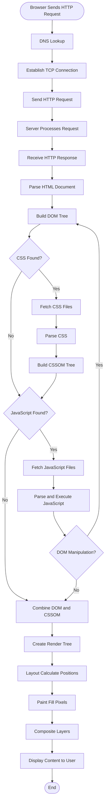

```mermaid
flowchart TD
    Start1([Browser Sends HTTP Request]) --> DNS[DNS Lookup]
    DNS --> TCP[Establish TCP Connection]
    TCP --> SendReq[Send HTTP Request]
    SendReq --> ServerProc[Server Processes Request]
    ServerProc --> RecvResp[Receive HTTP Response]
    
    RecvResp --> ParseHTML[Parse HTML Document]
    ParseHTML --> BuildDOM[Build DOM Tree]
    
    BuildDOM --> CheckCSS{CSS Found?}
    CheckCSS -->|Yes| FetchCSS[Fetch CSS Files]
    CheckCSS -->|No| CheckJS{JavaScript Found?}
    FetchCSS --> ParseCSS[Parse CSS]
    ParseCSS --> BuildCSSOM[Build CSSOM Tree]
    BuildCSSOM --> CheckJS
    
    CheckJS -->|Yes| FetchJS[Fetch JavaScript Files]
    CheckJS -->|No| RenderTree[Combine DOM and CSSOM]
    FetchJS --> ParseJS[Parse and Execute JavaScript]
    ParseJS --> DOMManip{DOM Manipulation?}
    DOMManip -->|Yes| BuildDOM
    DOMManip -->|No| RenderTree
    
    RenderTree --> CreateRT[Create Render Tree]
    CreateRT --> Layout[Layout Calculate Positions]
    Layout --> Paint[Paint Fill Pixels]
    Paint --> Composite[Composite Layers]
    Composite --> Display[Display Content to User]
    Display --> End1([End])
```