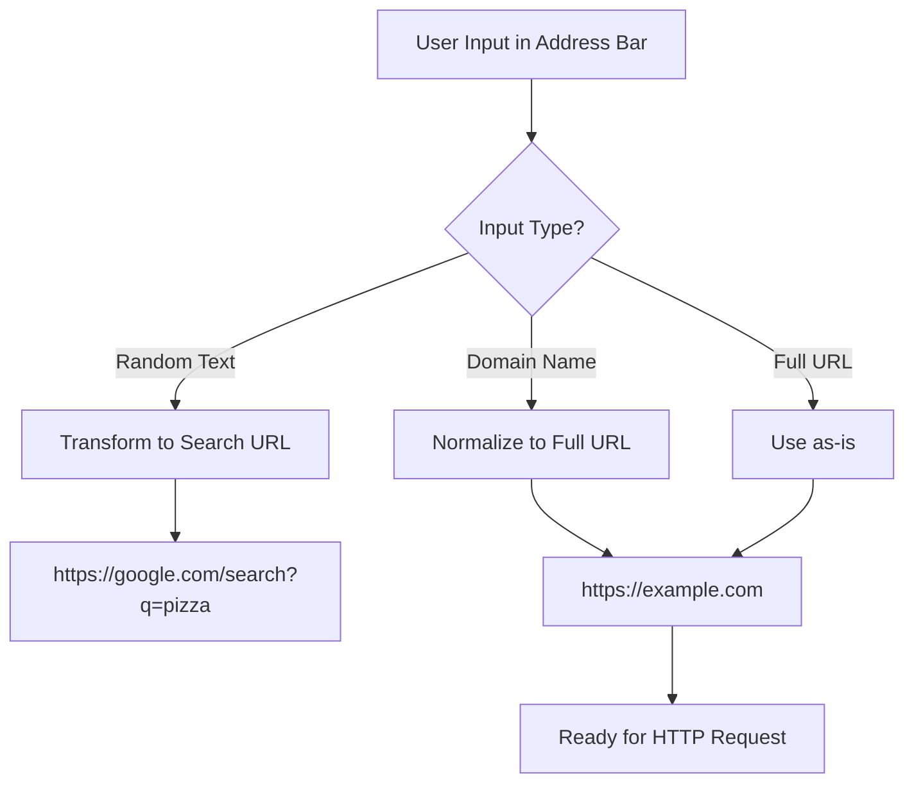
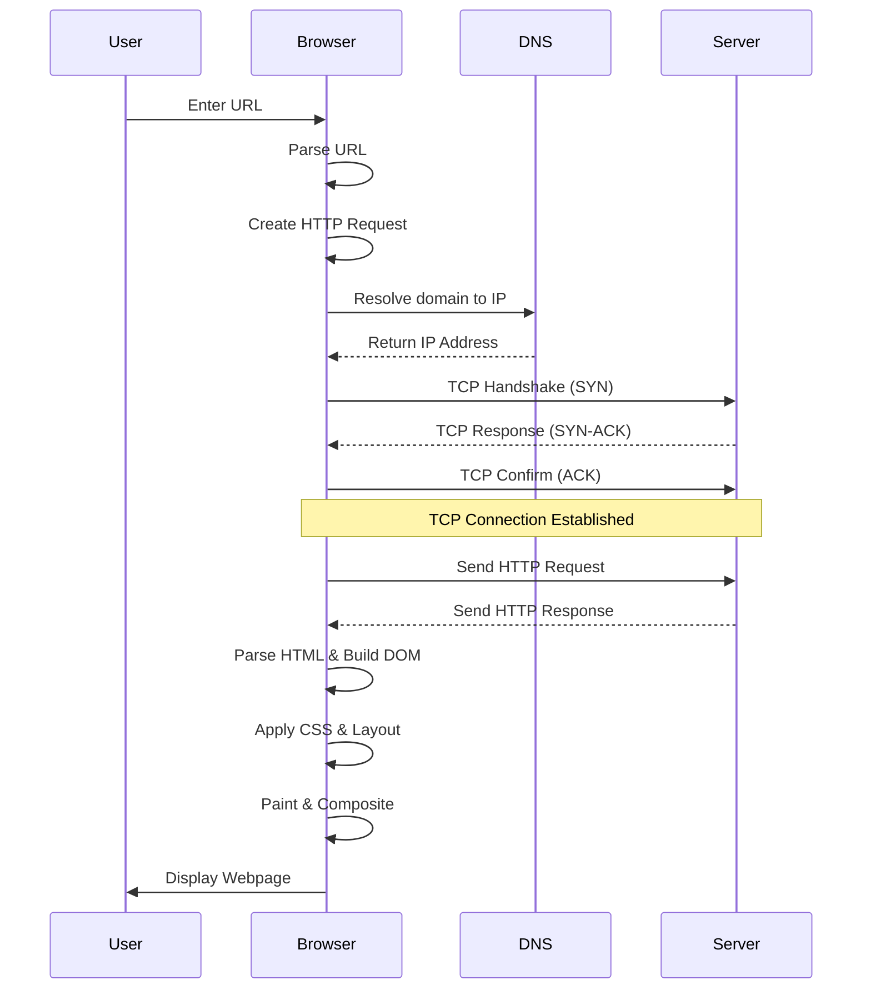
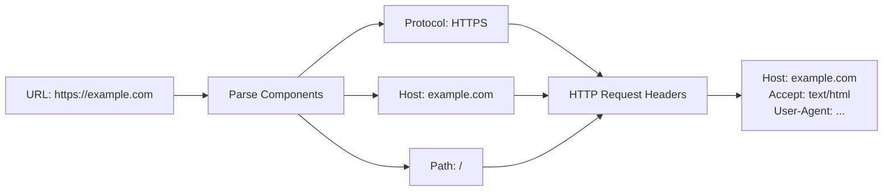
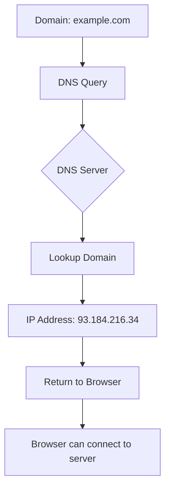
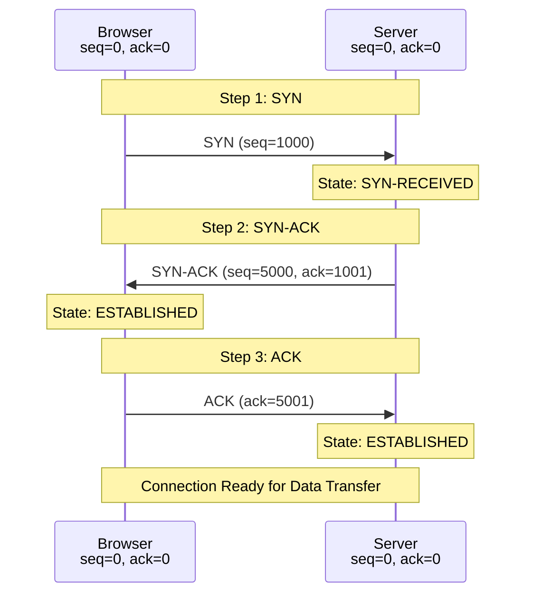
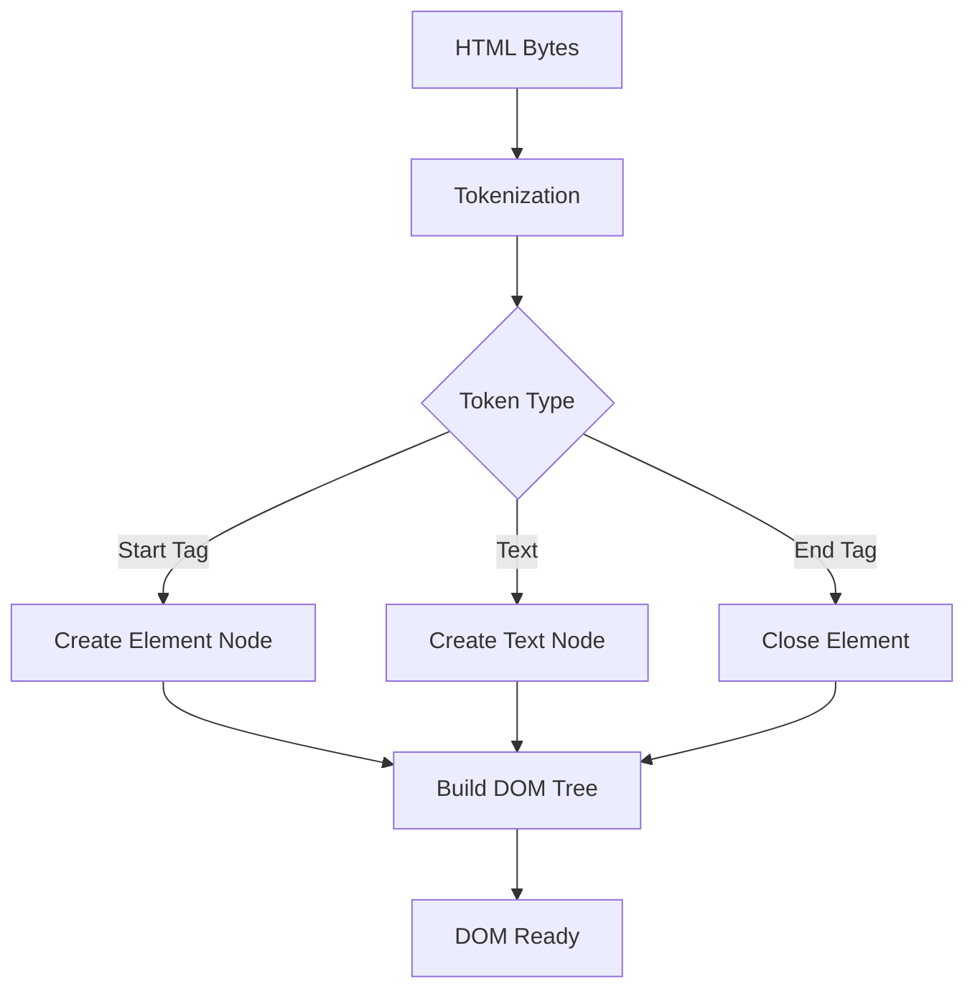
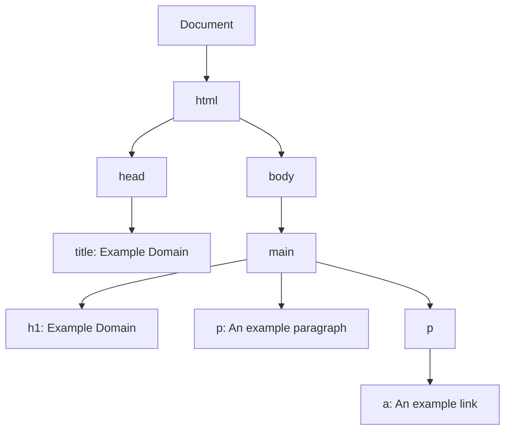

# How Browsers Work: A Visual Guide

## Overview
This guide explains the journey from typing a URL to seeing a webpage, using visual diagrams to illustrate each step.

---

## 1. URL Processing Flow

---

## 2. Complete Browser Request Pipeline

---

## 3. URL to HTTP Request Transformation

---

## 4. DNS Resolution Process

---

## 5. TCP Three-Way Handshake

---

## 6. HTML Parsing to DOM Tree

---

## 7. DOM Tree Structure Example

---

