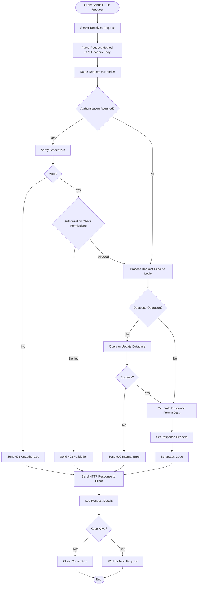

```mermaid
flowchart TD
    Start2([Client Sends HTTP Request]) --> ServerRecv[Server Receives Request]
    ServerRecv --> ParseReq[Parse Request Method URL Headers Body]
    
    ParseReq --> Routing[Route Request to Handler]
    Routing --> Auth{Authentication Required?}
    
    Auth -->|Yes| CheckAuth[Verify Credentials]
    Auth -->|No| ProcessReq[Process Request Execute Logic]
    CheckAuth --> AuthValid{Valid?}
    AuthValid -->|No| Send401[Send 401 Unauthorized]
    AuthValid -->|Yes| Authorize{Authorization Check Permissions}
    
    Authorize -->|Denied| Send403[Send 403 Forbidden]
    Authorize -->|Allowed| ProcessReq
    
    ProcessReq --> DataOp{Database Operation?}
    
    DataOp -->|Yes| QueryDB[Query or Update Database]
    DataOp -->|No| GenResp[Generate Response Format Data]
    QueryDB --> DBSuccess{Success?}
    DBSuccess -->|No| Send500[Send 500 Internal Error]
    DBSuccess -->|Yes| GenResp
    
    GenResp --> SetHeaders[Set Response Headers]
    SetHeaders --> SetStatus[Set Status Code]
    SetStatus --> SendResp[Send HTTP Response to Client]
    
    Send401 --> SendResp
    Send403 --> SendResp
    Send500 --> SendResp
    
    SendResp --> Log[Log Request Details]
    Log --> CloseConn{Keep-Alive?}
    CloseConn -->|No| Close[Close Connection]
    CloseConn -->|Yes| Wait[Wait for Next Request]
    Close --> End2([End])
    Wait --> End2
```