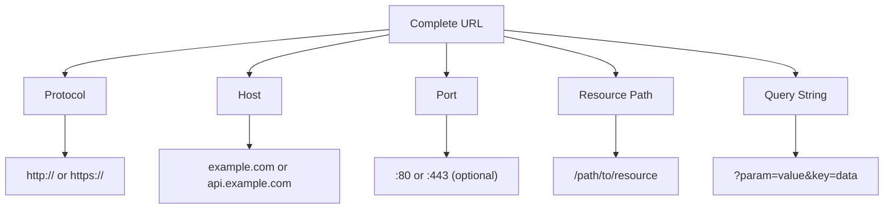
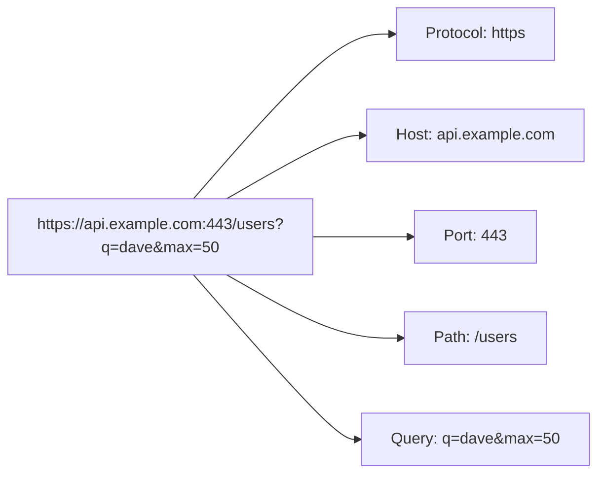
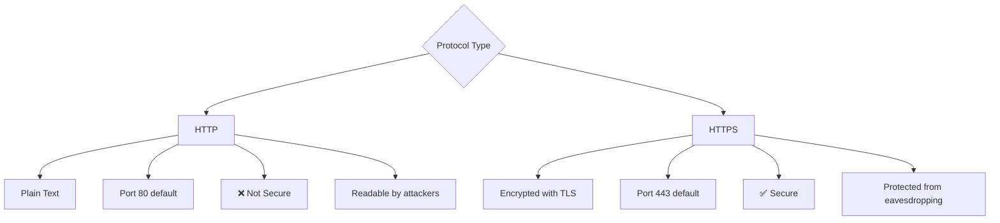
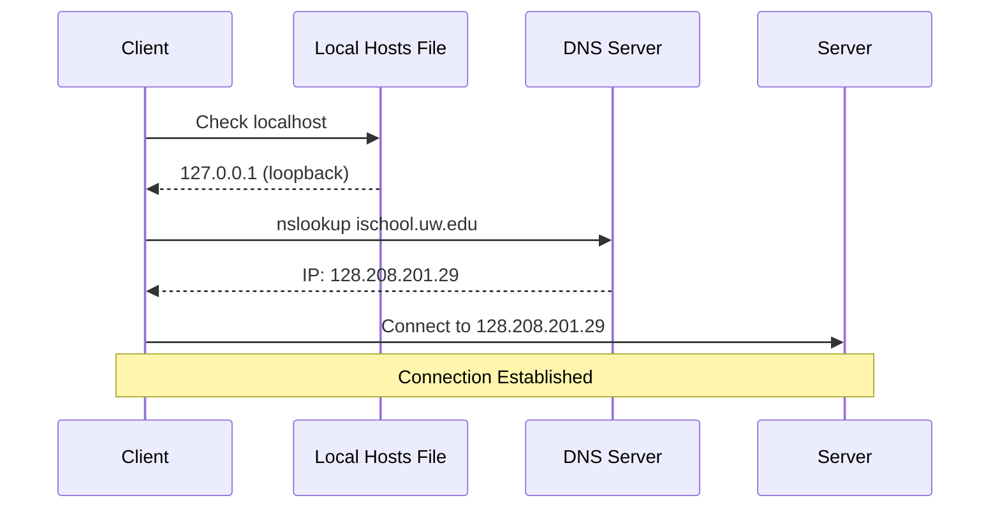
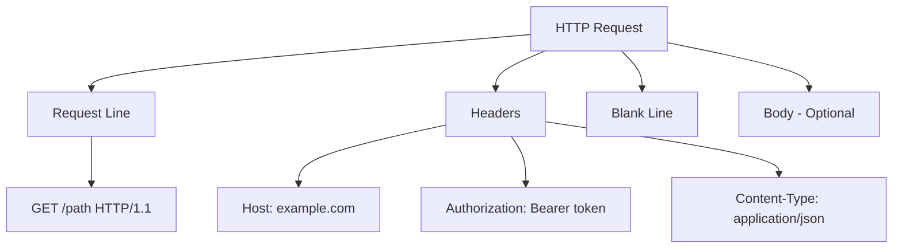
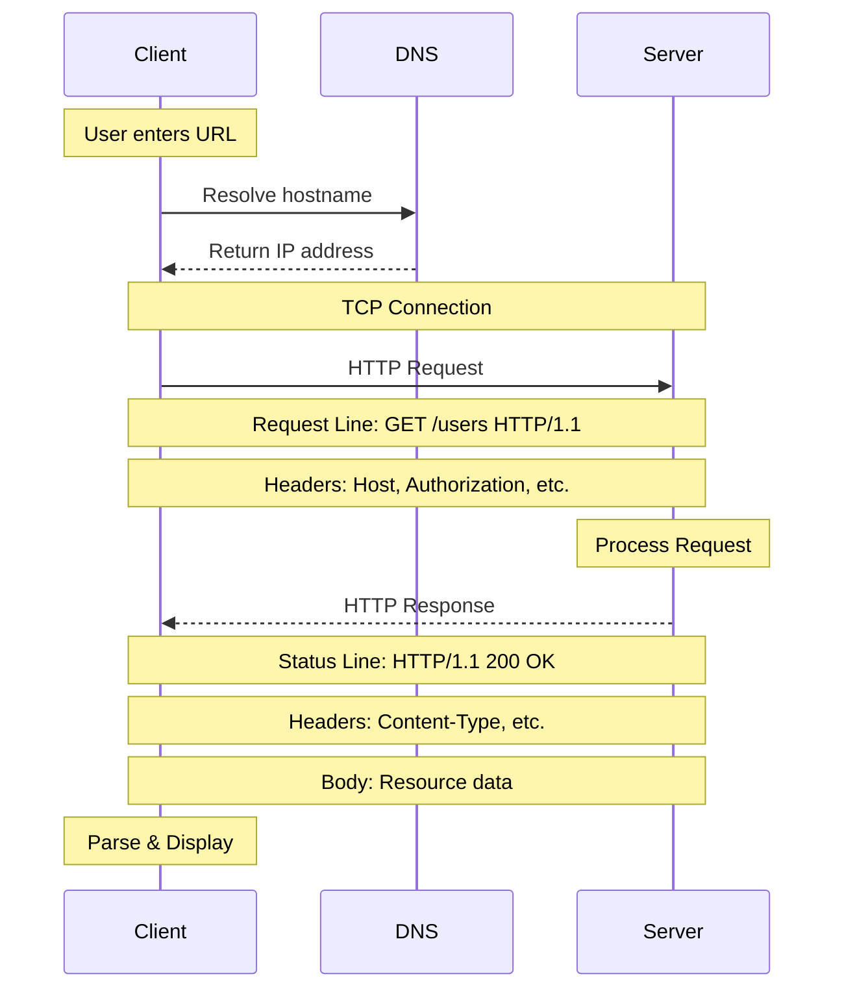

# The HyperText Transfer Protocol (HTTP)

## A Visual Guide to How HTTP Works

---

## 1. Anatomy of a URL

### URL Example Breakdown

---

## 2. Protocol Types

---

## 3. DNS Resolution Process

---

## 4. HTTP Request Structure

---

---

## 5. Complete HTTP Request/Response Cycle

